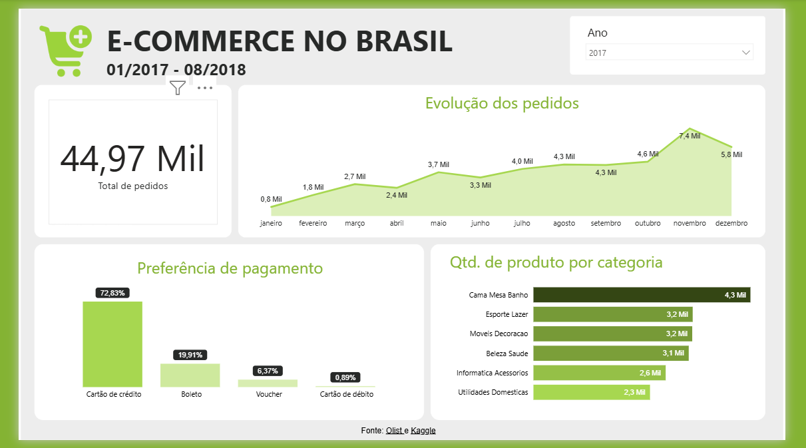

# 🛒 E-Commerce no Brasil — Dashboard de Vendas (Power BI)

Dashboard desenvolvido em Power BI para análise de vendas, comportamento do consumidor e desempenho de categorias de um e-commerce brasileiro, utilizando dados reais da Olist (disponíveis no Kaggle) entre janeiro de 2017 e agosto de 2018.
 
📊 Sobre o projeto

Este projeto tem como objetivo praticar e demonstrar habilidades de extração, transformação e carregamento de dados (ETL), modelagem de dados, cálculos em DAX e design de painéis focados em tomada de decisão corporativa.
O relatório reúne indicadores macro sobre a evolução dos pedidos, preferências de pagamento do público brasileiro e o ranking de produtos mais vendidos.

🧱 Modelo de dados

O projeto foi estruturado a partir de bases relacionais de e-commerce que envolvem:
* **Fato Vendas/Pedidos**: Registros detalhados de transações, datas de compra e volumes.
* **Dimensão Clientes/Pagamentos**: Tipos de checkout, volumetria e preferências de transação.
* **Dimensão Produtos**: Catálogo mapeado por categorias de mercado.

📈 O que o dashboard mostra

* **KPI Principal (Card)**: Total absoluto de pedidos acumulados no período (44,97 Mil pedidos).
* **Evolução dos Pedidos (Gráfico de Área)**: Visão temporal mensal demonstrando a sazonalidade do e-commerce, evidenciando o pico histórico em novembro de 2017 (7,4 Mil pedidos) devido ao impacto da Black Friday.
* **Preferência de Pagamento (Gráfico de Colunas)**: Divisão percentual das formas de pagamento, destacando a dominância do Cartão de Crédito (72,83%) sobre o Boleto Bancário (19,91%) e outras modalidades.
* **Quantidade de Produtos por Categoria (Gráfico de Barras)**: Ranking das categorias com maior volume de saída, liderado pelo setor de Cama, Mesa e Banho (4,3 Mil).
* **Filtros Interativos**: Segmentação dinâmica por Ano para análise isolada de safras.

🛠️ Tecnologias utilizadas

* **Power BI Desktop**
* **Power Query** (Modelagem, limpeza e tratamento dos dados textuais/nulos)
* **DAX** (Criação de medidas de agregação e inteligência de tempo)
* **Dataset da Olist (Kaggle)** como fonte de dados primária

🖼️ Prévia do dashboard

📁 Estrutura do repositório

ecommerce-brasil-dashboard/
├── Ecommerce_Brasil.pbix
├── image_ff2e91.png
└── README.md

🚀 Como visualizar

1. Baixe o arquivo `Ecommerce_Brasil.pbix` presente neste repositório.
2. Abra-o utilizando o **Power BI Desktop**.
3. Interaja com os filtros temporais para explorar os insights dinamicamente.

✍️ Autor

Desenvolvido por **Carlos Rocha Barbosa** como projeto de prática em inteligência de negócios e desenvolvimento de dashboards.

👉 [Conecte-se comigo no LinkedIn](https://www.linkedin.com/in/crbarbosa/) · [Meu GitHub](https://github.com/carlosrbarbosa)
